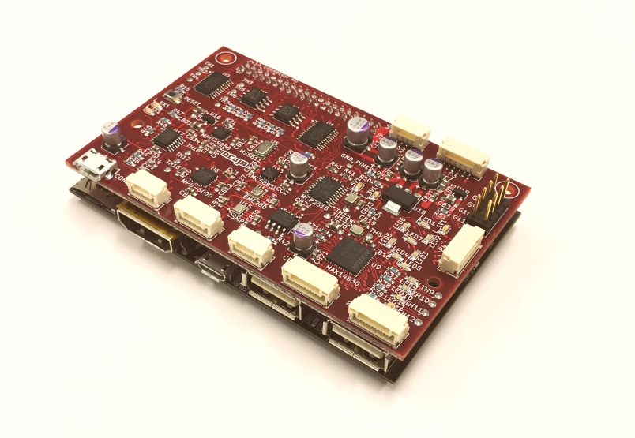

# yatagarasu-red

Kicad file of the shield which is to run ArduPilot on 96Boards.

## File list

Kicad project file

* yatagarasu-fit.pro

Schematic

* [yatagarasu-fit.pdf](./yatagarasu-fit.pdf)

## Videos on youtube of the first flight

* Used DragonBoard 410C (Snapdragon 410E).

### Video in English

### Video in Japanese

## Images

